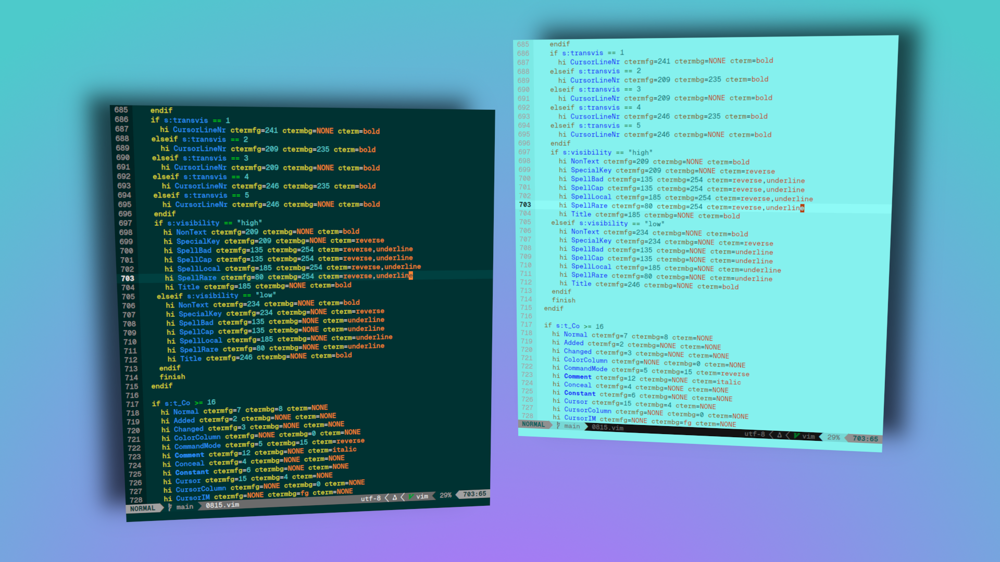

<h1 align="center"><p align="center"></p></h1>

<p align="center">It's a colorscheme. 🤖<br><br>

<ul>
   <li>dark/light theme ✔️</li>
   <li>contrast ratio of at least 4.5:1 ✔️</li>
   <li>CIELAB grading ✔️</li>
   <li>distinguishable colors ✔️</li>
</ul>
</p>
<br>
<i>Tell me what you think about the 🌞 light mode. It pops, right? 👓</i>
<br><br><br>

<details>
<summary><b>📸 SCREENSHOTS</b></summary>

</details>

<details>
<summary><b>SHOW 🐡 BLOAT</b> (unnecessary guide) 🤣🤣🤣</summary>

<h2 align="center">📦 Installation</h2>
Simply copy the <b>0815.vim</b> file to<br>
<b>.vim/colors/</b><br>
or<br>
<b>.config/nvim/colors/</b><br>
or<br>
use your preferred <b>plugin manager</b>.
<br><br>

<h2 align="center">💻 Usage</h2>
For <b>Vim</b> add the following line to your <b>.vimrc</b>.

```vim
colorscheme 0815
```
<br>
For <b>Neovim</b> add following line to your <b>init.lua</b>.

```lua
vim.cmd.colorscheme("0815")
```
<br>

<h2 align="center">🌓 Switch Modes</h2>
<h3 align="center">⬇️ Set default</h3>
If you want to set a specific mode as default you can define it in your .vimrc, init.lua or whatever your config file name is. 💁😆<br>
<br>
For <b>vimscript</b> set:

```vim
set background=light
```
For <b>lua</b> set:
```lua
vim.opt.background="light"
```
<br>

<h3 align="center">🔁 Manually switch during session</h3>
You can manually toggle between dark and light mode by executing the following commands in your running vim session.

```vim
:set background=dark
```
```vim
:set background=light
```
<br>

<h3 align="center">💣 Ultimate Toggle Switch</h3>
For the ultimate experience use the no bloat one-liner toggle switch <b>keybind</b> below. It sets up a dark/light toggle switch on <b>F12</b>.
<br>

<b>vimscript:</b>
```vim
nnoremap <F12> :let &background = (&background == "dark" ? "light" : "dark")<CR>
```

<b>lua:</b>
```lua
vim.keymap.set("n", "<F12>", "<cmd>let &background = (&background == 'dark' ? 'light' : 'dark')<CR>")
```

</details>